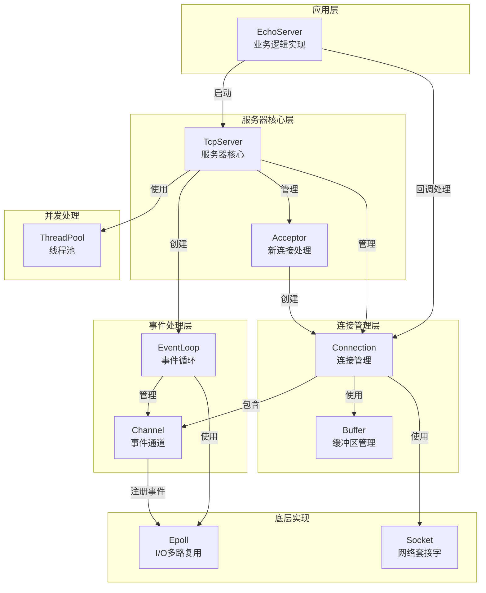

uu# BankServer 项目 README

## 1. 项目概述

### 1.1 项目简介
- 基于 C++ 和 Linux epoll 实现的高性能 TCP 网络服务器
- 支持多线程处理，采用事件驱动架构
- 适用于高并发网络应用场景

### 1.2 核心特性
- 基于 epoll 的 I/O 多路复用
- 多线程事件循环模型
- 非阻塞 I/O 操作
- 智能指针管理资源
- 函数对象回调机制
- 缓冲区管理

### 1.3 技术栈
- **语言**: C++11/14
- **网络**: TCP/IP, Linux Socket API
- **I/O 多路复用**: epoll
- **线程库**: pthread
- **编译工具**: g++
- **构建系统**: Makefile

## 2. 安装与运行

### 2.1 环境要求
- Linux 操作系统
- g++ 编译器 (支持 C++11 及以上)
- pthread 库
- make 工具

### 2.2 编译步骤
```bash
# 克隆项目
git clone <repository-url>
cd BankServer

# 编译项目
make

# 清理编译产物
make clean
```

### 2.3 运行方式
```bash
# 启动服务器
./tcpepoll

# 启动客户端
./client
```

## 3. 架构设计

### 3.1 整体架构图


### 3.2 核心模块关系
- **TcpServer**: 服务器核心，管理连接和事件循环
- **EchoServer**: 业务逻辑实现，处理客户端请求
- **EventLoop**: 事件循环，处理 I/O 事件
- **Connection**: 连接管理，处理数据收发
- **Epoll**: 底层 I/O 多路复用实现
- **ThreadPool**: 线程池，处理并发任务

## 4. 核心功能模块

### 4.1 TcpServer 模块
- **功能**: 服务器核心，管理连接生命周期
- **主要组件**:
  - Acceptor: 处理新连接
  - Connection: 管理客户端连接
  - EventLoop: 事件循环
- **关键方法**:
  - `start()`: 启动服务器
  - `newconnection()`: 处理新连接
  - `closeconnection()`: 处理连接关闭
  - `onmessage()`: 处理消息

### 4.2 EchoServer 模块
- **功能**: 业务逻辑实现，处理客户端请求
- **主要方法**:
  - `HandleNewConnection()`: 处理新连接
  - `HandleMessage()`: 处理客户端消息
  - `HandleClose()`: 处理连接关闭
  - `HandleError()`: 处理连接错误

### 4.3 EventLoop 模块
- **功能**: 事件循环，处理 I/O 事件
- **主要组件**:
  - Epoll: 底层 I/O 多路复用
  - Channel: 事件通道
- **关键方法**:
  - `run()`: 运行事件循环
  - `updatechannel()`: 更新通道事件
  - `queueinloopthread()`: 队列中执行任务

### 4.4 Connection 模块
- **功能**: 管理客户端连接，处理数据收发
- **主要组件**:
  - Socket: 网络套接字
  - Channel: 事件通道
  - Buffer: 缓冲区
- **关键方法**:
  - `onmessage()`: 处理消息
  - `send()`: 发送数据
  - `closecallback()`: 关闭回调

### 4.5 Buffer 模块
- **功能**: 管理数据缓冲区
- **关键方法**:
  - `append()`: 追加数据
  - `size()`: 获取大小
  - `data()`: 获取数据指针
  - `clear()`: 清空缓冲区

## 5. 工作流程

### 5.1 服务器启动流程
```mermaid
flowchart TD
    A[初始化 EchoServer] -->|创建| B[TcpServer 实例]
    B -->|初始化| C[EventLoop]
    C -->|创建| D[Epoll 实例]
    B -->|初始化| E[Acceptor]
    E -->|创建| F[监听 Socket]
    F -->|绑定| G[IP 和端口]
    F -->|监听| H[连接请求]
    B -->|启动| I[线程池]
    I -->|创建| J[工作线程]
    B -->|调用| K[start\(\) 方法]
    K -->|启动| L[EventLoop.run\(\)]
    L -->|等待| M[I/O 事件]
```

### 5.2 连接处理流程
```mermaid
flowchart TD
    A[客户端连接请求] -->|到达| B[监听 Socket]
    B -->|触发| C[Acceptor 处理]
    C -->|调用| D[TcpServer.newconnection\(\)]
    D -->|创建| E[Connection 实例]
    E -->|创建| F[客户端 Socket]
    E -->|创建| G[Channel 实例]
    G -->|注册| H[EventLoop]
    H -->|添加到| I[Epoll]
    E -->|存储| J[连接映射表]
    J -->|管理| K[连接生命周期]
    K -->|数据收发| L[Buffer 处理]
    K -->|连接关闭| M[清理资源]
```

### 5.3 消息处理流程
```mermaid
flowchart TD
    A[客户端发送数据] -->|到达| B[客户端 Socket]
    B -->|触发| C[Channel 可读事件]
    C -->|通知| D[EventLoop]
    D -->|调用| E[Connection.onmessage\(\)]
    E -->|读取| F[输入缓冲区]
    F -->|解析| G[消息内容]
    G -->|回调| H[EchoServer.HandleMessage\(\)]
    H -->|处理业务逻辑| I[生成响应]
    I -->|调用| J[Connection.send\(\)]
    J -->|写入| K[输出缓冲区]
    K -->|触发| L[Channel 可写事件]
    L -->|通知| M[EventLoop]
    M -->|调用| N[Connection.writecallback\(\)]
    N -->|发送| O[客户端]
```

### 5.4 事件循环流程
```mermaid
flowchart TD
    A[EventLoop.run\(\)] -->|启动| B[进入循环]
    B -->|调用| C[Epoll.wait\(\)]
    C -->|等待| D[I/O 事件]
    D -->|返回| E[就绪事件列表]
    E -->|遍历| F[处理每个事件]
    F -->|判断事件类型| G{事件类型}
    G -->|可读事件| H[处理可读事件]
    G -->|可写事件| I[处理可写事件]
    G -->|错误事件| J[处理错误事件]
    H -->|调用| K[Channel 回调]
    I -->|调用| L[Channel 回调]
    J -->|调用| M[Channel 回调]
    K -->|检查| N[是否有队列任务]
    L -->|检查| N
    M -->|检查| N
    N -->|有| O[执行队列任务]
    N -->|无| P[继续循环]
    O -->|完成后| P
    P -->|回到| B
```

## 6. 代码结构

### 6.1 目录结构
```
BankServer/
├── Acceptor.cpp        # 新连接接收器实现
├── Acceptor.h          # 新连接接收器头文件
├── Buffer.cpp          # 缓冲区实现
├── Buffer.h            # 缓冲区头文件
├── Channel.cpp         # 事件通道实现
├── Channel.h           # 事件通道头文件
├── Connection.cpp      # 连接管理实现
├── Connection.h        # 连接管理头文件
├── EchoServer.cpp      # 回显服务器实现
├── EchoServer.h        # 回显服务器头文件
├── Epoll.cpp           # epoll 封装实现
├── Epoll.h             # epoll 封装头文件
├── EventLoop.cpp       # 事件循环实现
├── EventLoop.h         # 事件循环头文件
├── InetAddress.cpp     # 网络地址实现
├── InetAddress.h       # 网络地址头文件
├── Socket.cpp          # 套接字实现
├── Socket.h            # 套接字头文件
├── TcpServer.cpp       # TCP 服务器实现
├── TcpServer.h         # TCP 服务器头文件
├── ThreadPool.hpp      # 线程池实现
├── Timestamp.cpp       # 时间戳实现
├── Timestamp.h         # 时间戳头文件
├── client.cpp          # 客户端实现
├── tcpepoll.cpp        # 服务器入口
├── makefile            # 构建文件
└── README.md           # 项目说明
```

### 6.2 核心文件说明
| 文件           | 描述                     | 主要功能                                         |
|----------------|--------------------------|--------------------------------------------------|
| TcpServer.h/cpp | 服务器核心类             | 管理连接和事件循环                               |
| EchoServer.h/cpp | 业务逻辑实现             | 处理客户端请求                                   |
| EventLoop.h/cpp | 事件循环                 | 处理 I/O 事件                                    |
| Connection.h/cpp | 连接管理                 | 处理数据收发                                     |
| Epoll.h/cpp    | epoll 封装               | 底层 I/O 多路复用实现                            |
| Buffer.h/cpp   | 缓冲区管理               | 处理数据缓冲                                     |
| ThreadPool.hpp | 线程池                   | 处理并发任务                                     |

## 7. 核心 API

### 7.1 TcpServer 类
```cpp
// 构造函数
TcpServer(const std::string &ip, const uint16_t port, unsigned short threadnum);

// 启动服务器
void start();

// 设置回调函数
void setnewconnectioncb(std::function<void(spConnection)> fn);
void setcloseconnectioncb(std::function<void(spConnection)> fn);
void seterrorconnectioncb(std::function<void(spConnection)> fn);
void setonmessagecb(std::function<void(spConnection, std::string &message)> fn);
void setsendcompletecb(std::function<void(spConnection)> fn);
void settimeoutcb(std::function<void(EventLoop*)> fn);
```

### 7.2 EchoServer 类
```cpp
// 构造函数
EchoServer(const std::string &ip, const uint16_t port, unsigned short IOthread, unsigned short workthread);

// 启动服务器
void Start();

// 回调函数
void HandleNewConnection(spConnection conn);
void HandleClose(spConnection conn);
void HandleError(spConnection conn);
void HandleMessage(spConnection conn, std::string message);
void HandleSendComplete(spConnection conn);
```

### 7.3 EventLoop 类
```cpp
// 构造函数
EventLoop();

// 运行事件循环
void run();

// 更新通道
void updatechannel(Channel *ch);

// 队列中执行任务
void queueinloopthread(function<void()>);
```

### 7.4 Connection 类
```cpp
// 构造函数
Connection(EventLoop* loop, Socket *clientsock);

// 发送数据
void send(const char *data, size_t size);

// 获取连接信息
string ip() const;
uint16_t port() const;
int fd() const;
```

## 8. 性能特点

### 8.1 高性能设计
- **非阻塞 I/O**: 避免线程阻塞
- **事件驱动**: 基于事件响应，而非轮询
- **多线程**: 充分利用多核 CPU
- **内存管理**: 智能指针自动管理资源
- **缓冲区优化**: 减少系统调用次数

### 8.2 并发处理能力
- **线程池**: 处理并发任务
- **多事件循环**: 分散 I/O 压力
- **连接管理**: 高效管理大量连接

## 9. 扩展与定制

### 9.1 扩展业务逻辑
- 继承 EchoServer 类
- 重写回调方法
- 实现自定义业务逻辑

### 9.2 定制服务器配置
- 修改线程池大小
- 调整事件循环参数
- 优化缓冲区大小

### 9.3 添加新功能
- 支持 SSL/TLS 加密
- 添加 HTTP 协议支持
- 实现数据库连接池
- 添加日志系统

## 10. 常见问题与解决方案

### 10.1 编译错误
- **问题**: 缺少 pthread 库
  **解决方案**: 确保编译命令中包含 `-pthread` 选项

- **问题**: C++ 标准版本不支持
  **解决方案**: 使用 `-std=c++11` 或更高标准编译

### 10.2 运行错误
- **问题**: 端口被占用
  **解决方案**: 修改服务器端口号

- **问题**: 权限不足
  **解决方案**: 确保有足够权限绑定端口

### 10.3 性能问题
- **问题**: 连接数过多
  **解决方案**: 调整线程池大小和事件循环数量

- **问题**: 内存占用高
  **解决方案**: 优化缓冲区大小，检查内存泄漏

## 11. 总结与展望

### 11.1 项目总结
- 实现了基于 epoll 的高性能 TCP 服务器
- 采用多线程事件循环模型
- 支持高并发连接处理
- 代码结构清晰，模块化设计

### 11.2 未来展望
- 支持更多协议 (HTTP, WebSocket 等)
- 添加监控和统计功能
- 实现负载均衡
- 支持分布式部署
- 优化内存使用和性能

## 12. 附录

### 12.1 参考资料
- Linux Socket 编程
- C++11 标准库
- epoll 官方文档
- 高性能服务器编程

### 12.2 术语表
- **epoll**: Linux 下的 I/O 多路复用机制
- **事件循环**: 处理 I/O 事件的循环
- **非阻塞 I/O**: 不会阻塞线程的 I/O 操作
- **智能指针**: 自动管理内存的指针
- **函数对象**: 可调用的对象，如 lambda 表达式
- **缓冲区**: 用于临时存储数据的内存区域

### 12.3 代码示例
#### 服务器启动示例
```cpp
// 创建并启动服务器
EchoServer server("127.0.0.1", 8888, 4, 8);
server.Start();
```

#### 客户端连接示例
```cpp
// 客户端连接服务器
// 发送数据
// 接收响应
```

## 流程图说明

本文档使用 Mermaid 语法创建了以下流程图，以帮助读者更直观地理解项目的架构和工作原理：

1. **整体架构图**: 展示了各个模块之间的关系，包括 TcpServer、EchoServer、EventLoop、Connection、Epoll 和 ThreadPool 等核心组件。

2. **服务器启动流程图**: 展示了服务器的启动流程，包括初始化、创建套接字、绑定端口、监听连接等步骤。

3. **连接管理示意图**: 展示了连接的生命周期管理，包括新连接建立、数据收发、连接关闭等过程。

4. **消息处理流程图**: 展示了客户端消息的处理流程，包括接收消息、解析消息、处理业务逻辑、发送响应等步骤。

5. **事件循环流程图**: 展示了事件循环的工作流程，包括等待事件、处理事件、执行队列任务等步骤。

这些流程图将帮助读者更直观地理解项目的架构和工作原理，提高文档的可读性和专业性。