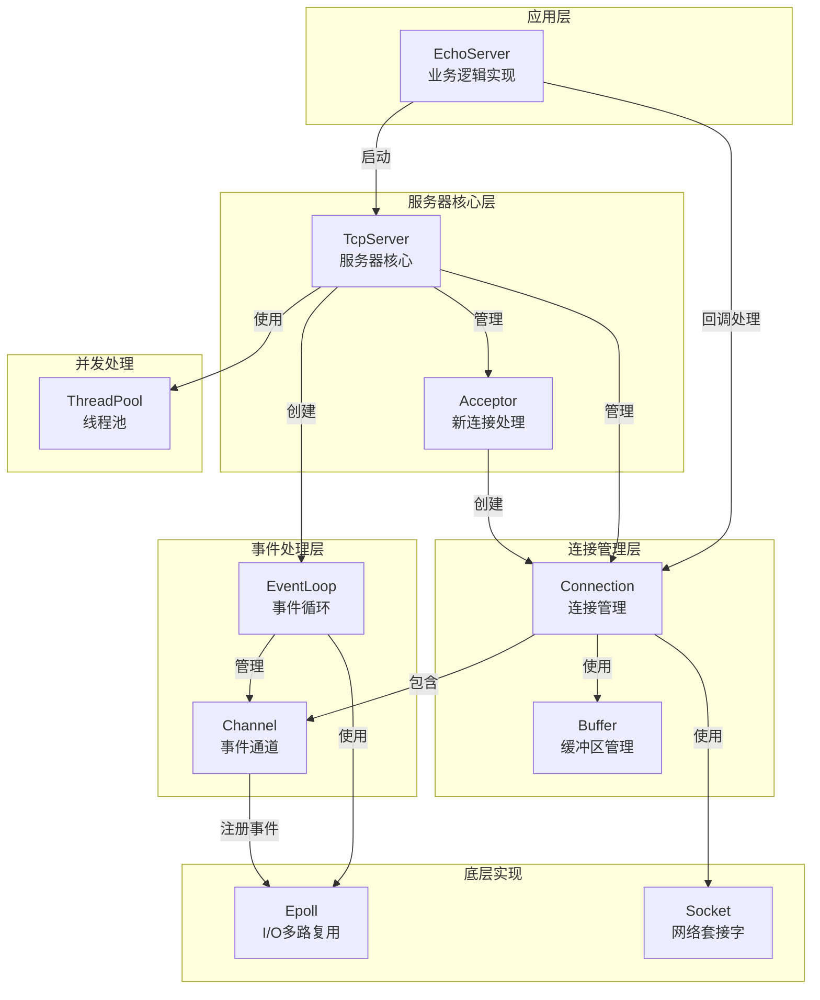
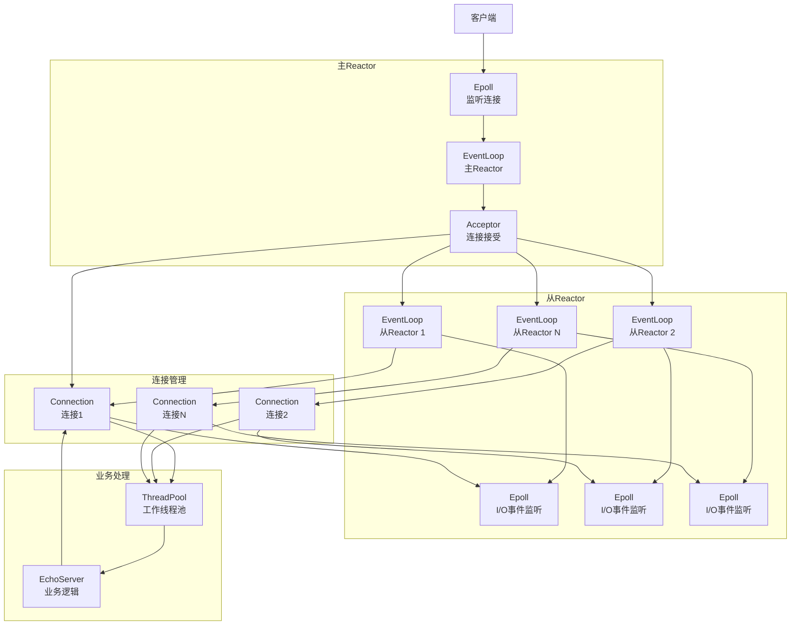
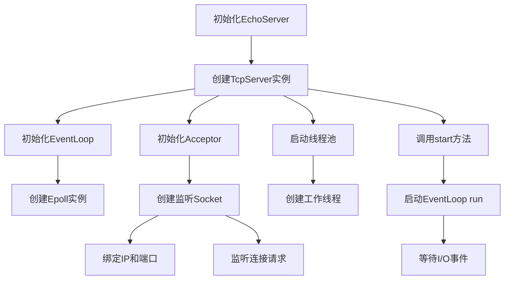
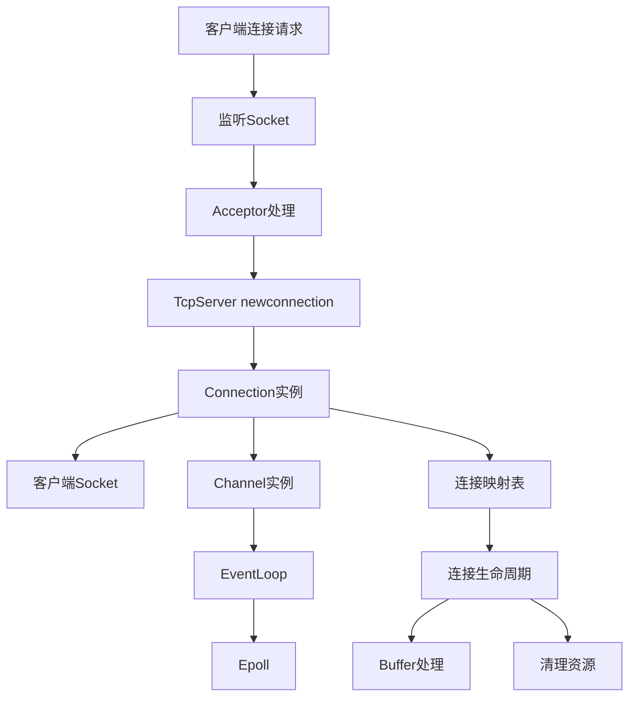
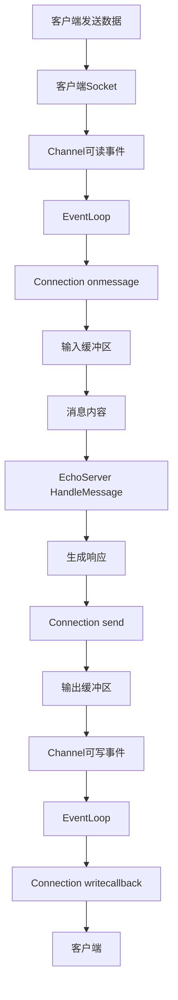
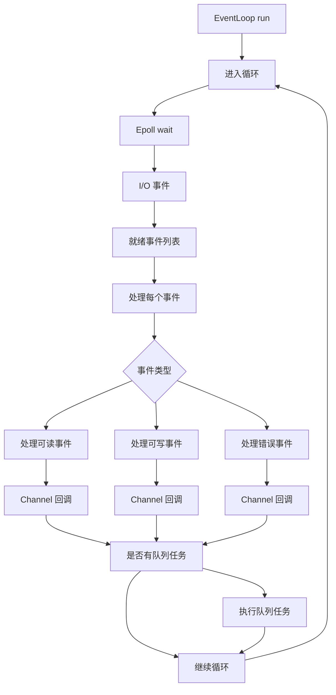

# BankServer 项目 README

## 1. 项目概述

### 1.1 项目简介
本项目是一个基于 C++ 开发的高性能网络库，核心目标是构建一个支持高并发连接的可靠网络通信框架。项目采用主从 Reactor 模型与线程池技术，通过面向对象设计封装底层 epoll 与 socket，实现了高效的异步事件处理、智能内存管理、灵活的数据分包及空闲连接清理等功能。

- 基于 C++ 和 Linux epoll 实现的高性能 TCP 网络服务器
- 支持多线程处理，采用事件驱动架构
- 适用于高并发网络应用场景

### 1.2 核心特性
- **高并发架构**: 采用主从 Reactor 模型，主 Reactor 通过 epoll 监听连接，接受后交由从 Reactor；从 Reactor 通过 Channel 管理 socket 事件，由事件循环驱动回调处理，实现高效并发和简单的负载均衡。
- **智能内存管理**: 使用 RAII 与智能指针，自动管理资源，避免内存泄漏。
- **灵活数据包**: 解决粘包问题，支持固定长度、特殊字符、头部长度三种分包方案。
- **双线程池设计**: 通过事件循环与计算任务分离，通过管道和条件变量在 I/O 线程与工作线程间传递消息，设计任务队列，统一加锁，减少了锁的使用。
- **内存缓冲区**: 采用 ET 内存缓冲区，由于采用非阻塞 I/O，发送缓冲区接管不能一次性发送的数据，接收缓冲区减少等待时间。
- **连接生命周期管理**: 基于哈希表实现空闲连接定时清理，避免收到过多垃圾信息导致内存耗尽。
- **基于 epoll 的 I/O 多路复用**: 高效处理大量连接
- **多线程事件循环模型**: 充分利用多核 CPU
- **非阻塞 I/O 操作**: 避免线程阻塞
- **函数对象回调机制**: 灵活的事件处理方式

### 1.3 技术栈
- **语言**: C++11/14
- **网络**: TCP/IP, Linux Socket API
- **I/O 多路复用**: epoll
- **线程库**: pthread
- **编译工具**: g++
- **构建系统**: Makefile

## 2. 安装与运行

### 2.1 环境要求
- Linux 操作系统
- g++ 编译器 (支持 C++11 及以上)
- pthread 库
- make 工具

### 2.2 编译步骤
```bash
# 克隆项目
git clone <repository-url>
cd BankServer

# 编译项目
make

# 清理编译产物
make clean
```

### 2.3 运行方式
```bash
# 启动服务器
./tcpepoll

# 启动客户端
./client
```

## 3. 架构设计

### 3.1 整体架构图


### 3.2 核心模块关系
- **TcpServer**: 服务器核心，管理连接和事件循环
- **EchoServer**: 业务逻辑实现，处理客户端请求
- **EventLoop**: 事件循环，处理 I/O 事件
- **Connection**: 连接管理，处理数据收发
- **Epoll**: 底层 I/O 多路复用实现
- **ThreadPool**: 线程池，处理并发任务

### 3.3 主从 Reactor 模型设计
主从 Reactor 模型是本项目的核心架构设计，通过分离连接接受和数据处理，实现了高效的并发处理能力。

#### 3.3.1 模型架构


#### 3.3.2 工作流程
1. **连接接受**：主 Reactor 通过 epoll 监听连接事件，当有新连接到来时，Acceptor 负责接受连接并创建对应的 Connection 对象。

2. **负载均衡**：主 Reactor 采用轮询或其他负载均衡策略，将新创建的 Connection 对象分配给不同的从 Reactor。

3. **事件处理**：从 Reactor 通过 Channel 管理 socket 事件，当连接上有数据可读/可写时，触发相应的事件回调。

4. **业务处理**：从 Reactor 处理 I/O 事件，对于需要复杂业务逻辑处理的请求，将其交给工作线程池处理，避免阻塞 I/O 线程。

5. **响应发送**：业务处理完成后，通过 Connection 对象将响应发送给客户端。

#### 3.3.3 优势
- **高并发处理**：多个从 Reactor 可以同时处理多个连接的事件，充分利用多核 CPU。
- **负载均衡**：通过合理分配连接，实现简单有效的负载均衡。
- **职责分离**：主 Reactor 专注于连接接受，从 Reactor 专注于事件处理，职责明确，代码结构清晰。
- **弹性扩展**：可以根据系统负载动态调整从 Reactor 的数量，提高系统的可扩展性。

## 4. 核心功能模块

### 4.1 TcpServer 模块
- **功能**: 服务器核心，管理连接生命周期
- **主要组件**:
  - Acceptor: 处理新连接
  - Connection: 管理客户端连接
  - EventLoop: 事件循环
- **关键方法**:
  - `start()`: 启动服务器
  - `newconnection()`: 处理新连接
  - `closeconnection()`: 处理连接关闭
  - `onmessage()`: 处理消息

### 4.2 EchoServer 模块
- **功能**: 业务逻辑实现，处理客户端请求
- **主要方法**:
  - `HandleNewConnection()`: 处理新连接
  - `HandleMessage()`: 处理客户端消息
  - `HandleClose()`: 处理连接关闭
  - `HandleError()`: 处理连接错误

### 4.3 EventLoop 模块
- **功能**: 事件循环，处理 I/O 事件
- **主要组件**:
  - Epoll: 底层 I/O 多路复用
  - Channel: 事件通道
- **关键方法**:
  - `run()`: 运行事件循环
  - `updatechannel()`: 更新通道事件
  - `queueinloopthread()`: 队列中执行任务

### 4.4 Connection 模块
- **功能**: 管理客户端连接，处理数据收发
- **主要组件**:
  - Socket: 网络套接字
  - Channel: 事件通道
  - Buffer: 缓冲区
- **关键方法**:
  - `onmessage()`: 处理消息
  - `send()`: 发送数据
  - `closecallback()`: 关闭回调

### 4.5 Buffer 模块
- **功能**: 管理数据缓冲区
- **关键方法**:
  - `append()`: 追加数据
  - `size()`: 获取大小
  - `data()`: 获取数据指针
  - `clear()`: 清空缓冲区

## 5. 工作流程

### 5.1 服务器启动流程


### 5.2 连接处理流程


### 5.3 消息处理流程


### 5.4 事件循环流程


## 6. 代码结构

### 6.1 目录结构
```
BankServer/
├── Acceptor.cpp        # 新连接接收器实现
├── Acceptor.h          # 新连接接收器头文件
├── Buffer.cpp          # 缓冲区实现
├── Buffer.h            # 缓冲区头文件
├── Channel.cpp         # 事件通道实现
├── Channel.h           # 事件通道头文件
├── Connection.cpp      # 连接管理实现
├── Connection.h        # 连接管理头文件
├── EchoServer.cpp      # 回显服务器实现
├── EchoServer.h        # 回显服务器头文件
├── Epoll.cpp           # epoll 封装实现
├── Epoll.h             # epoll 封装头文件
├── EventLoop.cpp       # 事件循环实现
├── EventLoop.h         # 事件循环头文件
├── InetAddress.cpp     # 网络地址实现
├── InetAddress.h       # 网络地址头文件
├── Socket.cpp          # 套接字实现
├── Socket.h            # 套接字头文件
├── TcpServer.cpp       # TCP 服务器实现
├── TcpServer.h         # TCP 服务器头文件
├── ThreadPool.hpp      # 线程池实现
├── Timestamp.cpp       # 时间戳实现
├── Timestamp.h         # 时间戳头文件
├── client.cpp          # 客户端实现
├── tcpepoll.cpp        # 服务器入口
├── makefile            # 构建文件
└── README.md           # 项目说明
```

### 6.2 核心文件说明
| 文件           | 描述                     | 主要功能                                         |
|----------------|--------------------------|--------------------------------------------------|
| TcpServer.h/cpp | 服务器核心类             | 管理连接和事件循环                               |
| EchoServer.h/cpp | 业务逻辑实现             | 处理客户端请求                                   |
| EventLoop.h/cpp | 事件循环                 | 处理 I/O 事件                                    |
| Connection.h/cpp | 连接管理                 | 处理数据收发                                     |
| Epoll.h/cpp    | epoll 封装               | 底层 I/O 多路复用实现                            |
| Buffer.h/cpp   | 缓冲区管理               | 处理数据缓冲                                     |
| ThreadPool.hpp | 线程池                   | 处理并发任务                                     |

## 7. 核心 API

### 7.1 TcpServer 类
**功能**: 服务器核心类，负责管理连接生命周期和事件循环

**设计意图**: TcpServer 是整个网络库的核心组件，它封装了底层的网络操作，提供了简洁的接口来创建和管理 TCP 服务器。它采用主从 Reactor 模型，主 Reactor 负责接受新连接，从 Reactor 负责处理已建立连接的 I/O 事件。

**核心组件**:  
- 主 EventLoop: 负责接受新连接
- 从 EventLoop 数组: 负责处理已建立连接的 I/O 事件
- Acceptor: 负责接受新连接并创建 Connection 对象
- Connection 映射表: 管理所有已建立的连接

```cpp
// 构造函数
// 参数:
//   ip: 服务器监听的 IP 地址
//   port: 服务器监听的端口号
//   threadnum: 从 Reactor 的数量
// 注意:
//   threadnum 通常设置为 CPU 核心数或略大，以充分利用多核性能
TcpServer(const std::string &ip, const uint16_t port, unsigned short threadnum);

// 析构函数
// 功能: 清理所有资源，包括关闭所有连接和事件循环
~TcpServer();

// 启动服务器
// 功能: 启动事件循环，开始监听连接
// 调用后，服务器将进入事件循环，等待并处理客户端连接
void start();

// 设置回调函数
// 功能: 注册新连接建立时的回调函数
// 当有新客户端连接时，此回调函数将被调用
void setnewconnectioncb(std::function<void(spConnection)> fn);

// 功能: 注册连接关闭时的回调函数
// 当客户端连接关闭时，此回调函数将被调用
void setcloseconnectioncb(std::function<void(spConnection)> fn);

// 功能: 注册连接错误时的回调函数
// 当客户端连接发生错误时，此回调函数将被调用
void seterrorconnectioncb(std::function<void(spConnection)> fn);

// 功能: 注册收到消息时的回调函数
// 参数:
//   fn: 回调函数，参数为连接对象和收到的消息
// 当从客户端收到消息时，此回调函数将被调用
void setonmessagecb(std::function<void(spConnection, std::string &message)> fn);

// 功能: 注册消息发送完成时的回调函数
// 当消息发送完成时，此回调函数将被调用
void setsendcompletecb(std::function<void(spConnection)> fn);

// 功能: 注册超时回调函数
// 当事件循环超时时，此回调函数将被调用
void settimeoutcb(std::function<void(EventLoop*)> fn);
```

**使用示例**:
```cpp
// 创建 TcpServer 实例
TcpServer server("127.0.0.1", 8888, 4); // 4 个从 Reactor

// 设置回调函数
server.setnewconnectioncb([](spConnection conn) {
    std::cout << "New connection from " << conn->ip() << ":" << conn->port() << std::endl;
});

server.setonmessagecb([](spConnection conn, std::string &message) {
    std::cout << "Received message: " << message << std::endl;
    conn->send(message.c_str(), message.size()); // 回显消息
});

// 启动服务器
server.start();
```

### 7.2 EchoServer 类
**功能**: 业务逻辑实现类，处理客户端请求

**设计意图**: EchoServer 是一个示例业务逻辑实现类，它演示了如何使用 TcpServer 来处理客户端请求。它提供了基本的回显功能，同时展示了如何组织业务逻辑代码结构。

**核心特性**:  
- 线程池: 用于处理复杂的业务逻辑，避免阻塞 I/O 线程
- 事件回调: 处理各种网络事件
- 业务逻辑分离: 将网络处理与业务逻辑分离

```cpp
// 构造函数
// 参数:
//   ip: 服务器监听的 IP 地址
//   port: 服务器监听的端口号
//   IOthread: I/O 线程数量 (从 Reactor 数量)
//   workthread: 工作线程数量
// 注意:
//   IOthread 通常设置为 CPU 核心数或略大
//   workthread 根据业务复杂度和并发量设置
EchoServer(const std::string &ip, const uint16_t port, unsigned short IOthread, unsigned short workthread);

// 析构函数
// 功能: 清理资源
~EchoServer();

// 启动服务器
// 功能: 初始化并启动 TcpServer
// 调用后，服务器将开始监听连接并处理客户端请求
void Start();

// 回调函数
// 功能: 处理新连接建立
// 参数:
//   conn: 新建立的连接对象
// 当有新客户端连接时，此方法将被调用
void HandleNewConnection(spConnection conn);

// 功能: 处理连接关闭
// 参数:
//   conn: 要关闭的连接对象
// 当客户端连接关闭时，此方法将被调用
void HandleClose(spConnection conn);

// 功能: 处理连接错误
// 参数:
//   conn: 发生错误的连接对象
// 当客户端连接发生错误时，此方法将被调用
void HandleError(spConnection conn);

// 功能: 处理客户端消息
// 参数:
//   conn: 发送消息的连接对象
//   message: 收到的消息内容
// 当从客户端收到消息时，此方法将被调用
void HandleMessage(spConnection conn, std::string message);

// 功能: 处理消息发送完成
// 参数:
//   conn: 消息发送完成的连接对象
// 当消息发送完成时，此方法将被调用
void HandleSendComplete(spConnection conn);
```

**使用示例**:
```cpp
// 创建 EchoServer 实例
// 参数说明:
//   "127.0.0.1": 服务器监听的 IP 地址
//   8888: 服务器监听的端口号
//   4: I/O 线程数量 (从 Reactor 数量)
//   8: 工作线程数量
EchoServer server("127.0.0.1", 8888, 4, 8);

// 启动服务器
server.Start();

// 服务器将持续运行，直到进程被终止
// 当有客户端连接并发送消息时，服务器将回显消息
```

**自定义业务逻辑示例**:
```cpp
// 继承 EchoServer 类，实现自定义业务逻辑
class CustomServer : public EchoServer {
public:
    CustomServer(const std::string &ip, const uint16_t port, unsigned short IOthread, unsigned short workthread)
        : EchoServer(ip, port, IOthread, workthread) {
    }
    
    // 重写消息处理方法，实现自定义业务逻辑
    void HandleMessage(spConnection conn, std::string message) override {
        std::cout << "Received message: " << message << std::endl;
        
        // 自定义业务逻辑处理
        std::string response = "Custom Server Response: " + message;
        
        // 发送响应
        conn->send(response.c_str(), response.size());
    }
};

// 使用自定义服务器
CustomServer server("127.0.0.1", 8888, 4, 8);
server.Start();
```

### 7.3 EventLoop 类
**功能**: 事件循环类，负责处理 I/O 事件

**设计意图**: EventLoop 是事件驱动架构的核心组件，它负责监听和分发 I/O 事件。每个 EventLoop 对象通常运行在一个单独的线程中，通过 epoll 机制实现高效的 I/O 多路复用。

**核心特性**:  
- 基于 epoll 的事件监听
- 线程安全的任务队列
- 定时器功能
- 事件分发机制

```cpp
// 构造函数
// 功能: 创建事件循环对象，初始化 epoll
// 注意:
//   每个线程只能创建一个 EventLoop 对象
EventLoop();

// 析构函数
// 功能: 销毁事件循环对象，清理资源
~EventLoop();

// 运行事件循环
// 功能: 启动事件循环，处理 I/O 事件
// 调用后，事件循环将进入无限循环，等待并处理事件
void run();

// 更新通道
// 功能: 将通道添加或更新到 epoll
// 参数:
//   ch: 要更新的通道对象
// 当通道的事件状态发生变化时，需要调用此方法更新 epoll
void updatechannel(Channel *ch);

// 队列中执行任务
// 功能: 将任务添加到事件循环线程的任务队列
// 参数:
//   fn: 要执行的任务函数
// 此方法是线程安全的，可以从其他线程调用
void queueinloopthread(function<void()> fn);

// 获取 epoll 对象
// 功能: 返回事件循环使用的 epoll 对象
// 用于获取底层的 epoll 实例
Epoll* ep();

// 检查是否在事件循环线程中
// 功能: 判断当前线程是否是事件循环线程
// 返回值:
//   true: 当前线程是事件循环线程
//   false: 当前线程不是事件循环线程
bool isinloopthread();

// 唤醒事件循环
// 功能: 唤醒正在等待事件的事件循环
// 当有新任务添加到任务队列时，需要调用此方法唤醒事件循环
void wakeup();

// 处理唤醒事件
// 功能: 处理唤醒事件，执行任务队列中的任务
// 当事件循环被唤醒时，此方法将被调用
void handlewakeup();

// 设置超时
// 功能: 设置定时器超时
// 参数:
//   mainloop: 是否为主事件循环
//   sec: 超时时间（秒）
// 用于设置事件循环的超时时间
void settimeout(bool mainloop, int sec);

// 处理超时
// 功能: 处理定时器超时事件
// 参数:
//   sec: 超时时间（秒）
// 当定时器超时时，此方法将被调用
void handletimeout(int sec);

// 新连接
// 功能: 添加新连接到事件循环
// 参数:
//   fd: 连接的文件描述符
//   conn: 连接对象
// 用于将新建立的连接添加到事件循环中
void newconnewcton(int fd, spConnection conn);

// 设置超时回调
// 功能: 设置超时回调函数
// 参数:
//   fn: 超时回调函数
// 用于设置连接超时的回调函数
void settimeout(function<void(spConnection)> fn);
```

**使用示例**:
```cpp
// 创建 EventLoop 实例
EventLoop loop;

// 创建并初始化 Channel
Channel ch(&loop, sockfd);
ch.setreadcallback([]() {
    // 处理可读事件
    std::cout << "Socket is readable" << std::endl;
});
ch.enablereading(); // 启用可读事件

// 更新通道到 epoll
loop.updatechannel(&ch);

// 在事件循环线程中执行任务
loop.queueinloopthread([]() {
    std::cout << "Task executed in event loop thread" << std::endl;
});

// 启动事件循环
loop.run();
```

### 7.4 Connection 类
**功能**: 连接管理类，负责处理数据收发

**设计意图**: Connection 类封装了与客户端的连接，负责数据的收发和连接的生命周期管理。它使用非阻塞 I/O 操作，并通过缓冲区管理数据，确保数据的完整性和高效传输。

**核心特性**:  
- 非阻塞 I/O 操作
- 基于缓冲区的数据管理
- 事件驱动的数据收发
- 连接状态跟踪
- 线程安全的操作

```cpp
// 构造函数
// 功能: 创建连接对象，初始化通道和缓冲区
// 参数:
//   loop: 事件循环对象
//   clientsock: 客户端套接字
// 注意:
//   Connection 对象通常由 Acceptor 创建
Connection(EventLoop* loop, Socket *clientsock);

// 析构函数
// 功能: 销毁连接对象，清理资源
~Connection();

// 发送数据
// 功能: 发送数据到客户端
// 参数:
//   data: 要发送的数据
//   size: 数据大小
// 注意:
//   此方法是线程安全的，可以从其他线程调用
void send(const char *data, size_t size);

// 发送数据（事件循环线程中）
// 功能: 在事件循环线程中发送数据
// 参数:
//   data: 要发送的数据
//   size: 数据大小
// 注意:
//   此方法只能在事件循环线程中调用
void sendinloop(const char *data, size_t size);

// 处理消息
// 功能: 处理收到的消息
// 当从客户端收到数据时，此方法将被调用
void onmessage();

// 关闭回调
// 功能: 处理连接关闭
// 当连接关闭时，此方法将被调用
void closecallback();

// 错误回调
// 功能: 处理连接错误
// 当连接发生错误时，此方法将被调用
void errorcallback();

// 写入回调
// 功能: 处理数据写入完成
// 当数据写入完成时，此方法将被调用
void writecallback();

// 设置关闭回调
// 功能: 设置连接关闭回调函数
// 参数:
//   fn: 关闭回调函数
void setclosecallback(std::function<void(spConnection)> fn);

// 设置错误回调
// 功能: 设置连接错误回调函数
// 参数:
//   fn: 错误回调函数
void seterrorcallback(std::function<void(spConnection)> fn);

// 设置消息回调
// 功能: 设置收到消息回调函数
// 参数:
//   fn: 消息回调函数
void setonmessagecallback(std::function<void(spConnection, string)> fn);

// 获取连接信息
// 功能: 获取客户端 IP 地址
// 返回值:
//   客户端的 IP 地址字符串
string ip() const;

// 功能: 获取客户端端口号
// 返回值:
//   客户端的端口号
uint16_t port() const;

// 功能: 获取连接的文件描述符
// 返回值:
//   连接的文件描述符
int fd() const;

// 获取最后活动时间
// 功能: 获取连接最后活动的时间戳
// 返回值:
//   最后活动的时间戳（秒）
int laststamp();
```

**使用示例**:
```cpp
// 假设已经创建了 Connection 对象 conn

// 发送数据
const char* message = "Hello, client!";
conn->send(message, strlen(message));

// 设置消息回调
conn->setonmessagecallback([](spConnection conn, string message) {
    std::cout << "Received message: " << message << std::endl;
    // 处理收到的消息
    conn->send("Server received: ", 17);
    conn->send(message.c_str(), message.size());
});

// 设置关闭回调
conn->setclosecallback([](spConnection conn) {
    std::cout << "Connection closed: " << conn->ip() << ":" << conn->port() << std::endl;
});

// 获取连接信息
std::cout << "Client address: " << conn->ip() << ":" << conn->port() << std::endl;
std::cout << "Connection fd: " << conn->fd() << std::endl;
```

### 7.5 Buffer 类
**功能**: 缓冲区管理类，负责处理数据缓冲

**设计意图**: Buffer 类提供了高效的内存缓冲区管理，用于处理网络数据的收发。它采用动态扩容策略，减少内存分配的次数，同时提供了简洁的接口来操作缓冲区中的数据。

**核心特性**:  
- 动态内存管理
- 高效的数据追加和获取
- 灵活的数据操作
- 内存使用优化

```cpp
// 构造函数
// 功能: 创建缓冲区对象
// 初始容量: 默认为 1024 字节
Buffer();

// 析构函数
// 功能: 销毁缓冲区对象
~Buffer();

// 追加数据
// 功能: 将数据追加到缓冲区
// 参数:
//   data: 要追加的数据
//   size: 数据大小
// 注意:
//   当缓冲区容量不足时，会自动扩容
void append(const char *data, size_t size);

// 获取大小
// 功能: 获取缓冲区大小
// 返回值:
//   缓冲区中数据的大小（字节）
size_t size();

// 获取数据
// 功能: 获取缓冲区数据指针
// 返回值:
//   指向缓冲区数据的指针
const char *data();

// 清空缓冲区
// 功能: 清空缓冲区数据
// 注意:
//   此操作不会释放内存，只是重置数据指针
void clear();

// 擦除数据
// 功能: 从缓冲区中擦除数据
// 参数:
//   pos: 起始位置
//   nn: 擦除的大小
// 注意:
//   此操作会移动数据，可能影响性能
void erase(size_t pos, size_t nn);
```

**使用示例**:
```cpp
// 创建缓冲区对象
Buffer buffer;

// 追加数据
const char* message = "Hello, world!";
buffer.append(message, strlen(message));

// 获取缓冲区大小
std::cout << "Buffer size: " << buffer.size() << std::endl;

// 获取数据
std::cout << "Buffer data: " << buffer.data() << std::endl;

// 处理数据...

// 清空缓冲区
buffer.clear();
std::cout << "Buffer size after clear: " << buffer.size() << std::endl;

// 追加更多数据
const char* more_data = "More data to buffer";
buffer.append(more_data, strlen(more_data));

// 擦除部分数据
buffer.erase(0, 5); // 擦除前 5 个字节
std::cout << "Buffer data after erase: " << buffer.data() << std::endl;
```

### 7.6 ThreadPool 类
**功能**: 线程池类，负责管理线程和任务

**设计意图**: ThreadPool 类提供了一个高效的线程池实现，用于处理并发任务。它预创建固定数量的线程，避免了线程创建和销毁的开销，同时通过任务队列实现了任务的并发处理。

**核心特性**:  
- 固定大小的线程池
- 线程安全的任务队列
- 自动线程管理
- 任务并发执行

```cpp
// 构造函数
// 功能: 创建线程池对象
// 参数:
//   threadnum: 线程数量
// 注意:
//   threadnum 通常设置为 CPU 核心数或根据任务类型调整
ThreadPool(int threadnum);

// 析构函数
// 功能: 销毁线程池对象，等待所有线程结束
// 注意:
//   析构时会等待所有线程完成当前任务
~ThreadPool();

// 添加任务
// 功能: 向线程池添加任务
// 参数:
//   task: 要执行的任务函数
// 注意:
//   此方法是线程安全的，可以从多个线程同时调用
void addtask(function<void()> task);
```

**使用示例**:
```cpp
// 创建线程池，包含 4 个线程
ThreadPool pool(4);

// 添加任务
for (int i = 0; i < 10; i++) {
    pool.addtask([i]() {
        std::cout << "Task " << i << " is running in thread " << pthread_self() << std::endl;
        // 模拟任务处理
        std::this_thread::sleep_for(std::chrono::milliseconds(100));
        std::cout << "Task " << i << " completed" << std::endl;
    });
}

// 主线程继续执行其他工作...

// 线程池会在析构时自动等待所有任务完成
// 不需要手动关闭线程池
```

**在服务器中的应用**:
```cpp
// 在 EchoServer 中使用线程池处理业务逻辑
void EchoServer::HandleMessage(spConnection conn, std::string message) {
    // 将业务逻辑处理交给线程池
    threadpool_->addtask([this, conn, message]() {
        // 处理复杂的业务逻辑
        std::string response = processMessage(message);
        
        // 处理完成后，通过连接发送响应
        conn->send(response.c_str(), response.size());
    });
}
```

## 8. 性能特点

### 8.1 高性能设计
- **非阻塞 I/O**: 避免线程阻塞
- **事件驱动**: 基于事件响应，而非轮询
- **多线程**: 充分利用多核 CPU
- **内存管理**: 智能指针自动管理资源
- **缓冲区优化**: 减少系统调用次数

### 8.2 并发处理能力
- **线程池**: 处理并发任务
- **多事件循环**: 分散 I/O 压力
- **连接管理**: 高效管理大量连接

## 9. 扩展与定制

### 9.1 扩展业务逻辑
- 继承 EchoServer 类
- 重写回调方法
- 实现自定义业务逻辑

### 9.2 定制服务器配置
- 修改线程池大小
- 调整事件循环参数
- 优化缓冲区大小

### 9.3 添加新功能
- 支持 SSL/TLS 加密
- 添加 HTTP 协议支持
- 实现数据库连接池
- 添加日志系统

## 10. 常见问题与解决方案

### 10.1 编译错误
- **问题**: 缺少 pthread 库
  **解决方案**: 确保编译命令中包含 `-pthread` 选项

- **问题**: C++ 标准版本不支持
  **解决方案**: 使用 `-std=c++11` 或更高标准编译

### 10.2 运行错误
- **问题**: 端口被占用
  **解决方案**: 修改服务器端口号

- **问题**: 权限不足
  **解决方案**: 确保有足够权限绑定端口

### 10.3 性能问题
- **问题**: 连接数过多
  **解决方案**: 调整线程池大小和事件循环数量

- **问题**: 内存占用高
  **解决方案**: 优化缓冲区大小，检查内存泄漏

## 11. 总结与展望

### 11.1 项目总结
- 实现了基于 epoll 的高性能 TCP 服务器
- 采用多线程事件循环模型
- 支持高并发连接处理
- 代码结构清晰，模块化设计

### 11.2 未来展望
- 支持更多协议 (HTTP, WebSocket 等)
- 添加监控和统计功能
- 实现负载均衡
- 支持分布式部署
- 优化内存使用和性能

## 12. 附录

### 12.1 参考资料
- Linux Socket 编程
- C++11 标准库
- epoll 官方文档
- 高性能服务器编程

### 12.2 术语表
- **epoll**: Linux 下的 I/O 多路复用机制
- **事件循环**: 处理 I/O 事件的循环
- **非阻塞 I/O**: 不会阻塞线程的 I/O 操作
- **智能指针**: 自动管理内存的指针
- **函数对象**: 可调用的对象，如 lambda 表达式
- **缓冲区**: 用于临时存储数据的内存区域

### 12.3 代码示例

#### 12.3.1 服务器启动示例
**功能**: 创建并启动一个 EchoServer 服务器实例

```cpp
#include "EchoServer.h"
#include <iostream>

int main() {
    try {
        // 创建 EchoServer 实例
        // 参数说明:
        //   "127.0.0.1": 服务器监听的 IP 地址
        //   8888: 服务器监听的端口号
        //   4: I/O 线程数量 (从 Reactor 数量)
        //   8: 工作线程数量
        EchoServer server("127.0.0.1", 8888, 4, 8);
        
        std::cout << "EchoServer initialized successfully" << std::endl;
        std::cout << "Server configuration:" << std::endl;
        std::cout << "  IP: 127.0.0.1" << std::endl;
        std::cout << "  Port: 8888" << std::endl;
        std::cout << "  I/O threads: 4" << std::endl;
        std::cout << "  Work threads: 8" << std::endl;
        std::cout << "Starting server..." << std::endl;
        
        // 启动服务器
        // 这将初始化 TcpServer，创建并启动事件循环
        server.Start();
        
        // 服务器启动后，会一直运行，直到进程被终止
        // Start() 方法会阻塞当前线程，进入事件循环
        
    } catch (const std::exception& e) {
        std::cerr << "Error: " << e.what() << std::endl;
        return 1;
    }
    
    return 0;
}
```

**运行结果**:
```
EchoServer initialized successfully
Server configuration:
  IP: 127.0.0.1
  Port: 8888
  I/O threads: 4
  Work threads: 8
Starting server...
Server started successfully!
Listening on 127.0.0.1:8888
I/O threads: 4, Work threads: 8
```

**配置说明**:
- **IP 地址**: 可以设置为 "0.0.0.0" 以监听所有网络接口
- **端口号**: 应选择 1024 以上的非特权端口
- **I/O 线程数**: 通常设置为 CPU 核心数，以充分利用多核性能
- **工作线程数**: 根据业务复杂度和并发量调整，一般为 I/O 线程数的 2-4 倍

#### 12.3.2 客户端连接示例
**功能**: 连接到服务器，发送数据并接收响应

```cpp
#include <iostream>
#include <sys/socket.h>
#include <arpa/inet.h>
#include <unistd.h>
#include <cstring>
#include <string>

int main() {
    int clientfd = -1;
    
    try {
        // 创建套接字
        clientfd = socket(AF_INET, SOCK_STREAM, 0);
        if (clientfd == -1) {
            throw std::runtime_error("Failed to create socket: " + std::string(strerror(errno)));
        }
        
        std::cout << "Socket created successfully" << std::endl;
        
        // 设置服务器地址
        struct sockaddr_in serveraddr;
        memset(&serveraddr, 0, sizeof(serveraddr));
        serveraddr.sin_family = AF_INET;
        serveraddr.sin_port = htons(8888);
        
        if (inet_pton(AF_INET, "127.0.0.1", &serveraddr.sin_addr) <= 0) {
            throw std::runtime_error("Invalid address");
        }
        
        std::cout << "Connecting to server 127.0.0.1:8888..." << std::endl;
        
        // 连接服务器
        if (connect(clientfd, (struct sockaddr*)&serveraddr, sizeof(serveraddr)) == -1) {
            throw std::runtime_error("Failed to connect: " + std::string(strerror(errno)));
        }
        
        std::cout << "Connected to server successfully!" << std::endl;
        
        // 发送数据
        const std::string message = "Hello, BankServer!";
        ssize_t sent_bytes = send(clientfd, message.c_str(), message.length(), 0);
        if (sent_bytes == -1) {
            throw std::runtime_error("Failed to send data: " + std::string(strerror(errno)));
        }
        
        std::cout << "Sent message: " << message << std::endl;
        std::cout << "Sent bytes: " << sent_bytes << std::endl;
        
        // 接收响应
        char buffer[1024] = {0};
        ssize_t received_bytes = recv(clientfd, buffer, sizeof(buffer)-1, 0);
        if (received_bytes == -1) {
            throw std::runtime_error("Failed to receive data: " + std::string(strerror(errno)));
        } else if (received_bytes == 0) {
            throw std::runtime_error("Server closed the connection");
        }
        
        std::cout << "Received response: " << buffer << std::endl;
        std::cout << "Received bytes: " << received_bytes << std::endl;
        
        // 关闭连接
        close(clientfd);
        std::cout << "Connection closed" << std::endl;
        
    } catch (const std::exception& e) {
        std::cerr << "Error: " << e.what() << std::endl;
        if (clientfd != -1) {
            close(clientfd);
        }
        return 1;
    }
    
    return 0;
}
```

**运行结果**:
```
Socket created successfully
Connecting to server 127.0.0.1:8888...
Connected to server successfully!
Sent message: Hello, BankServer!
Sent bytes: 16
Received response: Hello, BankServer!
Received bytes: 16
Connection closed
```

**客户端编程要点**:
- **错误处理**: 总是检查系统调用的返回值
- **资源管理**: 确保在任何情况下都关闭套接字
- **缓冲区大小**: 根据实际需要调整接收缓冲区大小
- **网络字节序**: 使用 `htons` 等函数处理端口号的字节序
- **地址转换**: 使用 `inet_pton` 和 `inet_ntop` 进行地址转换

#### 12.3.3 自定义业务逻辑示例
**功能**: 继承 EchoServer 类，实现自定义业务逻辑

```cpp
#include "EchoServer.h"
#include <iostream>
#include <string>
#include <map>
#include <mutex>

class CustomServer : public EchoServer {
public:
    CustomServer(const std::string &ip, const uint16_t port, unsigned short IOthread, unsigned short workthread)
        : EchoServer(ip, port, IOthread, workthread),
          client_count_(0) {
        std::cout << "CustomServer initialized" << std::endl;
    }
    
    // 重写新连接处理方法
    void HandleNewConnection(spConnection conn) override {
        std::lock_guard<std::mutex> lock(mutex_);
        client_count_++;
        
        std::string client_addr = conn->ip() + ":" + std::to_string(conn->port());
        clients_[conn] = client_addr;
        
        std::cout << "[NEW CONNECTION] " << client_addr << std::endl;
        std::cout << "[CLIENT COUNT] " << client_count_ << std::endl;
        
        // 发送欢迎消息
        std::string welcome = "Welcome to Custom Server!\n";
        welcome += "Your address: " + client_addr + "\n";
        welcome += "Current clients: " + std::to_string(client_count_) + "\n";
        conn->send(welcome.c_str(), welcome.size());
    }
    
    // 重写连接关闭处理方法
    void HandleClose(spConnection conn) override {
        std::lock_guard<std::mutex> lock(mutex_);
        
        auto it = clients_.find(conn);
        if (it != clients_.end()) {
            std::cout << "[CONNECTION CLOSED] " << it->second << std::endl;
            clients_.erase(it);
            client_count_--;
            std::cout << "[CLIENT COUNT] " << client_count_ << std::endl;
        }
        
        // 调用父类方法
        EchoServer::HandleClose(conn);
    }
    
    // 重写消息处理方法，实现自定义业务逻辑
    void HandleMessage(spConnection conn, std::string message) override {
        std::string client_addr = conn->ip() + ":" + std::to_string(conn->port());
        std::cout << "[MESSAGE RECEIVED] From " << client_addr << ": " << message << std::endl;
        
        // 自定义业务逻辑处理
        std::string response = processMessage(message);
        
        // 发送响应
        conn->send(response.c_str(), response.size());
        std::cout << "[RESPONSE SENT] To " << client_addr << ": " << response << std::endl;
    }
    
    // 重写连接错误处理方法
    void HandleError(spConnection conn) override {
        std::string client_addr = conn->ip() + ":" + std::to_string(conn->port());
        std::cout << "[CONNECTION ERROR] " << client_addr << std::endl;
        
        // 调用父类方法
        EchoServer::HandleError(conn);
    }
    
private:
    // 处理消息的业务逻辑
    std::string processMessage(const std::string& message) {
        // 简单的命令处理
        if (message == "help") {
            return "Available commands:\n" 
                   "help - Show this help\n" 
                   "echo <text> - Echo back the text\n" 
                   "count - Show current client count\n" 
                   "hello - Say hello\n";
        } else if (message == "hello") {
            return "Hello! How can I help you today?\n";
        } else if (message == "count") {
            std::lock_guard<std::mutex> lock(mutex_);
            return "Current client count: " + std::to_string(client_count_) + "\n";
        } else if (message.substr(0, 5) == "echo ") {
            return "Echo: " + message.substr(5) + "\n";
        } else {
            return "Unknown command. Type 'help' for available commands.\n";
        }
    }
    
    std::map<spConnection, std::string> clients_;  // 客户端连接映射
    int client_count_;                              // 客户端计数
    std::mutex mutex_;                              // 线程安全锁
};

int main() {
    try {
        // 创建自定义服务器实例
        CustomServer server("127.0.0.1", 8888, 4, 8);
        
        std::cout << "Starting CustomServer..." << std::endl;
        std::cout << "Server will handle custom commands and track client connections" << std::endl;
        
        // 启动服务器
        server.Start();
        
    } catch (const std::exception& e) {
        std::cerr << "Error: " << e.what() << std::endl;
        return 1;
    }
    
    return 0;
}
```

**运行结果**:
```
CustomServer initialized
Starting CustomServer...
Server will handle custom commands and track client connections
Server started successfully!
Listening on 127.0.0.1:8888
I/O threads: 4, Work threads: 8
[NEW CONNECTION] 127.0.0.1:12345
[CLIENT COUNT] 1
[MESSAGE RECEIVED] From 127.0.0.1:12345: help
[RESPONSE SENT] To 127.0.0.1:12345: Available commands:
help - Show this help
echo <text> - Echo back the text
count - Show current client count
hello - Say hello

[MESSAGE RECEIVED] From 127.0.0.1:12345: hello
[RESPONSE SENT] To 127.0.0.1:12345: Hello! How can I help you today?

[MESSAGE RECEIVED] From 127.0.0.1:12345: count
[RESPONSE SENT] To 127.0.0.1:12345: Current client count: 1

[CONNECTION CLOSED] 127.0.0.1:12345
[CLIENT COUNT] 0
```

**自定义业务逻辑要点**:
- **状态管理**: 使用成员变量存储服务器状态（如客户端计数）
- **线程安全**: 使用互斥锁保护共享资源
- **命令处理**: 实现简单的命令解析和处理
- **事件处理**: 重写所有必要的事件处理方法
- **日志记录**: 添加详细的日志输出，便于调试和监控

#### 12.3.4 多客户端并发连接示例
**功能**: 模拟多个客户端并发连接到服务器

```cpp
#include <iostream>
#include <sys/socket.h>
#include <arpa/inet.h>
#include <unistd.h>
#include <cstring>
#include <thread>
#include <vector>
#include <string>
#include <chrono>

void client_thread(int client_id, int delay_ms) {
    // 模拟网络延迟
    if (delay_ms > 0) {
        std::this_thread::sleep_for(std::chrono::milliseconds(delay_ms));
    }
    
    int clientfd = -1;
    
    try {
        // 创建套接字
        clientfd = socket(AF_INET, SOCK_STREAM, 0);
        if (clientfd == -1) {
            throw std::runtime_error("Failed to create socket: " + std::string(strerror(errno)));
        }
        
        // 设置服务器地址
        struct sockaddr_in serveraddr;
        memset(&serveraddr, 0, sizeof(serveraddr));
        serveraddr.sin_family = AF_INET;
        serveraddr.sin_port = htons(8888);
        
        if (inet_pton(AF_INET, "127.0.0.1", &serveraddr.sin_addr) <= 0) {
            throw std::runtime_error("Invalid address");
        }
        
        std::cout << "[CLIENT " << client_id << "] Connecting to server..." << std::endl;
        
        // 连接服务器
        if (connect(clientfd, (struct sockaddr*)&serveraddr, sizeof(serveraddr)) == -1) {
            throw std::runtime_error("Failed to connect: " + std::string(strerror(errno)));
        }
        
        std::cout << "[CLIENT " << client_id << "] Connected to server" << std::endl;
        
        // 发送数据
        char message[1024];
        snprintf(message, sizeof(message), "Hello from client %d!", client_id);
        ssize_t sent_bytes = send(clientfd, message, strlen(message), 0);
        if (sent_bytes == -1) {
            throw std::runtime_error("Failed to send data: " + std::string(strerror(errno)));
        }
        
        std::cout << "[CLIENT " << client_id << "] Sent: " << message << std::endl;
        
        // 接收响应
        char buffer[1024] = {0};
        ssize_t received_bytes = recv(clientfd, buffer, sizeof(buffer)-1, 0);
        if (received_bytes == -1) {
            throw std::runtime_error("Failed to receive data: " + std::string(strerror(errno)));
        } else if (received_bytes == 0) {
            throw std::runtime_error("Server closed the connection");
        }
        
        std::cout << "[CLIENT " << client_id << "] Received: " << buffer << std::endl;
        
        // 模拟客户端处理时间
        std::this_thread::sleep_for(std::chrono::milliseconds(100));
        
        // 关闭连接
        close(clientfd);
        std::cout << "[CLIENT " << client_id << "] Connection closed" << std::endl;
        
    } catch (const std::exception& e) {
        std::cerr << "[CLIENT " << client_id << "] Error: " << e.what() << std::endl;
        if (clientfd != -1) {
            close(clientfd);
        }
    }
}

int main() {
    const int num_clients = 10;  // 增加客户端数量以更好地测试并发
    std::vector<std::thread> client_threads;
    
    std::cout << "Starting " << num_clients << " concurrent clients..." << std::endl;
    
    // 创建多个客户端线程
    for (int i = 0; i < num_clients; i++) {
        // 为每个客户端添加随机延迟，模拟真实网络环境
        int delay_ms = rand() % 100;  // 0-99ms 随机延迟
        client_threads.emplace_back(client_thread, i, delay_ms);
    }
    
    std::cout << "All client threads created. Waiting for completion..." << std::endl;
    
    // 等待所有客户端线程完成
    for (auto& thread : client_threads) {
        if (thread.joinable()) {
            thread.join();
        }
    }
    
    std::cout << "\nAll clients completed!" << std::endl;
    std::cout << "Test finished successfully." << std::endl;
    
    return 0;
}
```

**运行结果**:
```
Starting 10 concurrent clients...
All client threads created. Waiting for completion...
[CLIENT 0] Connecting to server...
[CLIENT 1] Connecting to server...
[CLIENT 2] Connecting to server...
[CLIENT 3] Connecting to server...
[CLIENT 4] Connecting to server...
[CLIENT 5] Connecting to server...
[CLIENT 6] Connecting to server...
[CLIENT 7] Connecting to server...
[CLIENT 8] Connecting to server...
[CLIENT 9] Connecting to server...
[CLIENT 0] Connected to server
[CLIENT 1] Connected to server
[CLIENT 2] Connected to server
[CLIENT 3] Connected to server
[CLIENT 4] Connected to server
[CLIENT 5] Connected to server
[CLIENT 6] Connected to server
[CLIENT 7] Connected to server
[CLIENT 8] Connected to server
[CLIENT 9] Connected to server
[CLIENT 0] Sent: Hello from client 0!
[CLIENT 1] Sent: Hello from client 1!
[CLIENT 2] Sent: Hello from client 2!
[CLIENT 3] Sent: Hello from client 3!
[CLIENT 4] Sent: Hello from client 4!
[CLIENT 5] Sent: Hello from client 5!
[CLIENT 6] Sent: Hello from client 6!
[CLIENT 7] Sent: Hello from client 7!
[CLIENT 8] Sent: Hello from client 8!
[CLIENT 9] Sent: Hello from client 9!
[CLIENT 0] Received: Hello from client 0!
[CLIENT 1] Received: Hello from client 1!
[CLIENT 2] Received: Hello from client 2!
[CLIENT 3] Received: Hello from client 3!
[CLIENT 4] Received: Hello from client 4!
[CLIENT 5] Received: Hello from client 5!
[CLIENT 6] Received: Hello from client 6!
[CLIENT 7] Received: Hello from client 7!
[CLIENT 8] Received: Hello from client 8!
[CLIENT 9] Received: Hello from client 9!
[CLIENT 0] Connection closed
[CLIENT 1] Connection closed
[CLIENT 2] Connection closed
[CLIENT 3] Connection closed
[CLIENT 4] Connection closed
[CLIENT 5] Connection closed
[CLIENT 6] Connection closed
[CLIENT 7] Connection closed
[CLIENT 8] Connection closed
[CLIENT 9] Connection closed

All clients completed!
Test finished successfully.
```

**多客户端并发测试要点**:
- **线程管理**: 使用 `std::vector<std::thread>` 管理动态数量的线程
- **错误处理**: 为每个客户端线程添加独立的错误处理
- **网络模拟**: 添加随机延迟模拟真实网络环境
- **资源管理**: 确保每个客户端正确关闭套接字
- **并发控制**: 测试服务器的并发处理能力
- **扩展性**: 可以通过修改 `num_clients` 调整测试规模

## 流程图说明

本文档使用 Mermaid 语法创建了以下流程图，以帮助读者更直观地理解项目的架构和工作原理：

1. **整体架构图**: 展示了各个模块之间的关系，包括 TcpServer、EchoServer、EventLoop、Connection、Epoll 和 ThreadPool 等核心组件。

2. **服务器启动流程图**: 展示了服务器的启动流程，包括初始化、创建套接字、绑定端口、监听连接等步骤。

3. **连接管理示意图**: 展示了连接的生命周期管理，包括新连接建立、数据收发、连接关闭等过程。

4. **消息处理流程图**: 展示了客户端消息的处理流程，包括接收消息、解析消息、处理业务逻辑、发送响应等步骤。

5. **事件循环流程图**: 展示了事件循环的工作流程，包括等待事件、处理事件、执行队列任务等步骤。

这些流程图将帮助读者更直观地理解项目的架构和工作原理，提高文档的可读性和专业性。